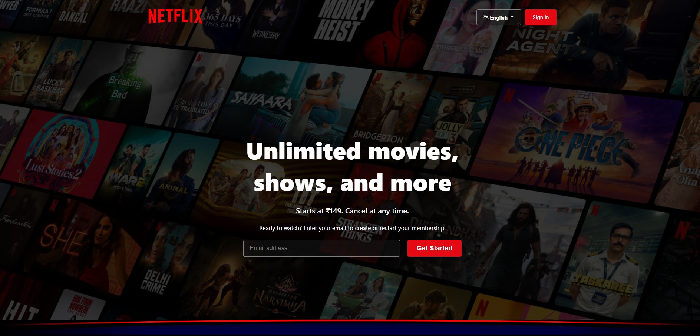
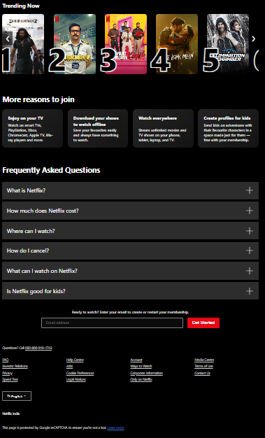

# Netflix-Homepage
# Netflix Clone (HTML + CSS)

This is a responsive Netflix homepage clone built using HTML and CSS.

## Features
- Responsive design (mobile, tablet, desktop)
- Hero section with background image
- Trending slider (CSS)
- Feature cards section
- FAQ section
- Footer layout

## What I Learned
- Flexbox and Grid
- Responsive design using media queries
- CSS positioning and layout techniques

## Future Improvements
- Add JavaScript for slider functionality
- Add FAQ accordion interaction
- Improve animations

## Preview

### Desktop View

### Mobile View

